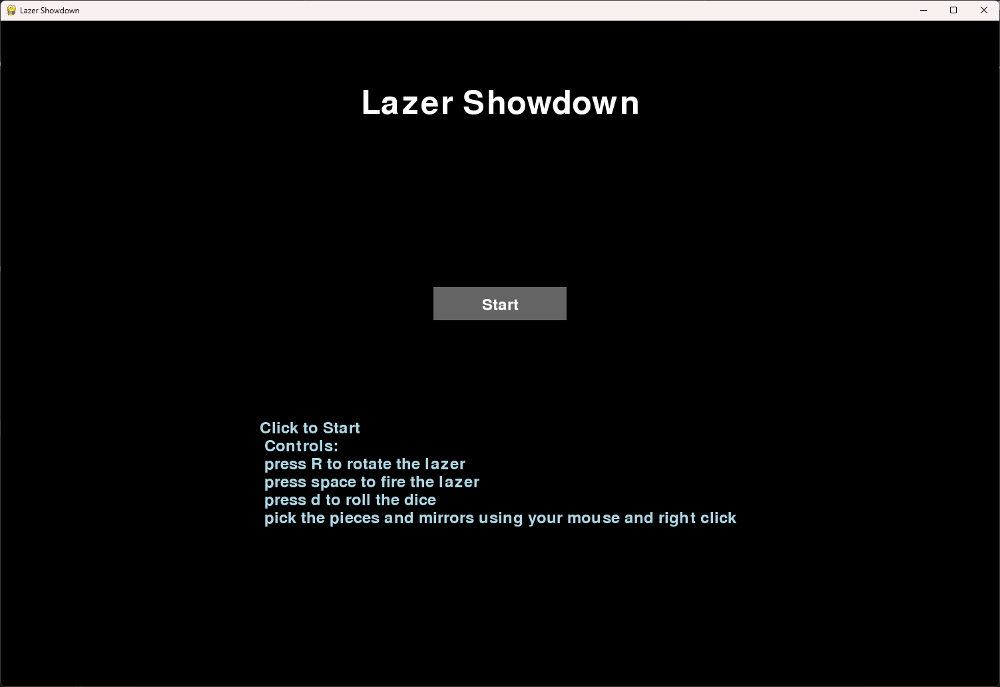
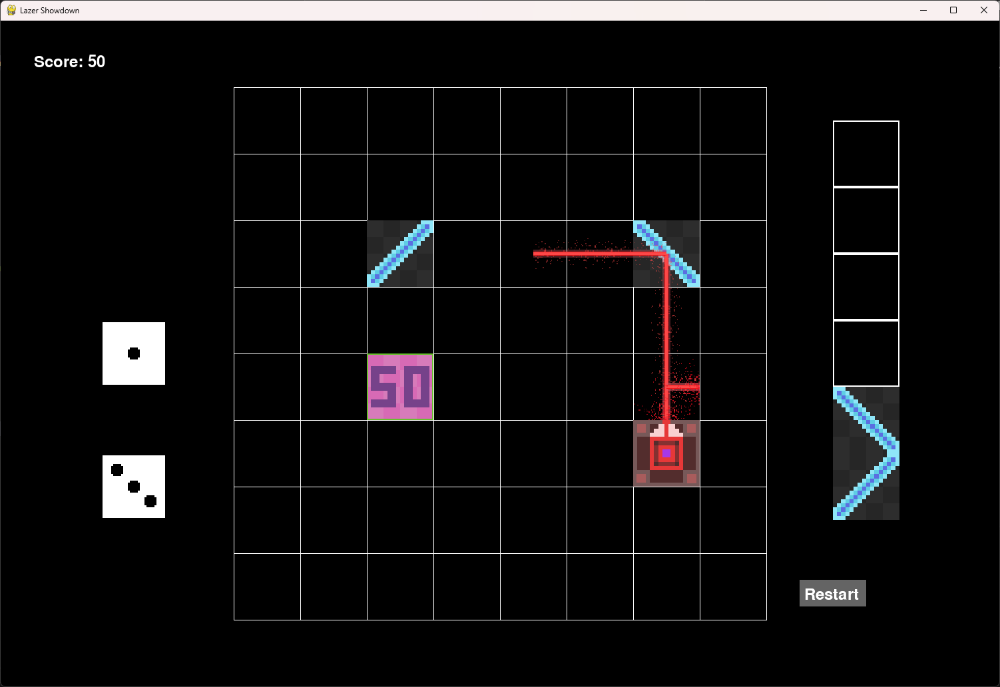

# Lazer Showdown

**Lazer Showdown** is a strategic, physics-based puzzle game where players place laser pieces on a grid to direct lasers toward points of interest. The game features drag-and-drop functionality for moving pieces, two types of mirrors with different directional properties, and an engaging challenge to solve puzzles and rack up points.

## Features

- **Drag-and-Drop Gameplay**: Move laser pieces and mirrors on the grid to solve puzzles.
- **Multiple Pieces**: Includes laser pieces, mirrors (with different directions), and point pieces that can be used to score points.
- **Scoring System**: Earn points by properly directing lasers to the point pieces.
- **pixel style art**: all sprites are cutomizeable and have been set to a pixel-style artwork

## Gameplay Controls

The game allows you to interact with the grid and pieces through a combination of mouse and keyboard controls.

### Mouse Controls
- **Drag-and-Drop**: 
  - Left-click and hold to drag a piece from the palette (on the right side of the screen) to the grid.
  - Release the mouse button to drop the piece onto the grid.
  - The pieces will snap to the nearest valid grid position when released.

- **Click to Select**: 
  - Click on a piece (laser, mirror, or point) to select it.
  - Once selected, you can move the piece around the grid using drag-and-drop.

### Keyboard Controls
- **Fire Laser (Spacebar)**: 
  - Press the **Spacebar** to fire the laser from the selected laser piece. The laser will travel in its set direction and interact with mirrors and point pieces on the grid.

- **Rotate Laser (R key)**: 
  - Press the **R** key to rotate the laser's direction. Each press of the **R** key will cycle through the directions: **Up**, **Right**, **Down**, **Left**.

- **Reset the Game (Click Restart Button)**: 
  - Click the "Restart" button in the bottom-center of the screen to reset the game to its initial state.

### Dice Controls
  - **roll dice (D key)**
    - press the **D** key to roll a pair dice.

### Grid and Pieces Interaction
- **Grid Placement**: 
  - When you place a piece on the grid, it will "snap" to the closest grid cell. The grid helps you align pieces accurately.

- **Laser Reflection**: 
  - Mirrors placed on the grid will reflect the laser. Use **/ mirrors** for one type of reflection and **\ mirrors** for the other type.
  - The laser will bounce off the mirror based on its orientation, changing its path.


## Installation

To play **Lazer Showdown** on your local machine, follow these steps:

### Requirements
- Python 3.x
- Pygame library (for rendering graphics)

### Steps to Install

1. Clone this repository:
    ```bash
    git clone https://github.com/denzven/Lazer_Showdown.git
    ```

2. Navigate to the project directory:
    ```bash
    cd Lazer_Showdown
    ```

3. Install the required Python dependencies:
    ```bash
    pip install pygame
    ```

4. Run the game:
    ```bash
    python main.py
    ```

## Gameplay

- **Starting the Game**: When the game starts, you'll be presented with a start screen. Click the "Start" button to begin the game.
- **Placing Pieces**: Drag and drop the laser, mirrors, and points onto the grid.
    - **Laser Pieces**: These pieces will fire lasers in the specified direction.
    - **Mirror Pieces**: Mirrors can reflect the laser in different directions depending on their orientation (`/` or `\`).
    - **Point Pieces**: Place point pieces on the grid to score points when a laser reaches them.
- **Goal**: The goal of the game is to strategically position the laser and mirrors to hit the point pieces and score as many points as possible.




## Contributing

Feel free to fork this project and submit pull requests. If you find any issues or have suggestions for new features, please create an issue or contact me directly.

### Steps to Contribute:
1. Fork the repository.
2. Create a feature branch (`git checkout -b feature/your-feature`).
3. Commit your changes (`git commit -am 'Add new feature'`).
4. Push to the branch (`git push origin feature/your-feature`).
5. Create a new pull request.

## License

This project is licensed under the MIT License - see the [LICENSE](LICENSE) file for details.

## Acknowledgements

- **Pygame** for the game development library.

## Contact

If you have any questions or suggestions, feel free to reach out at:
- **GitHub**: [https://github.com/denzven](https://github.com/denzven)

